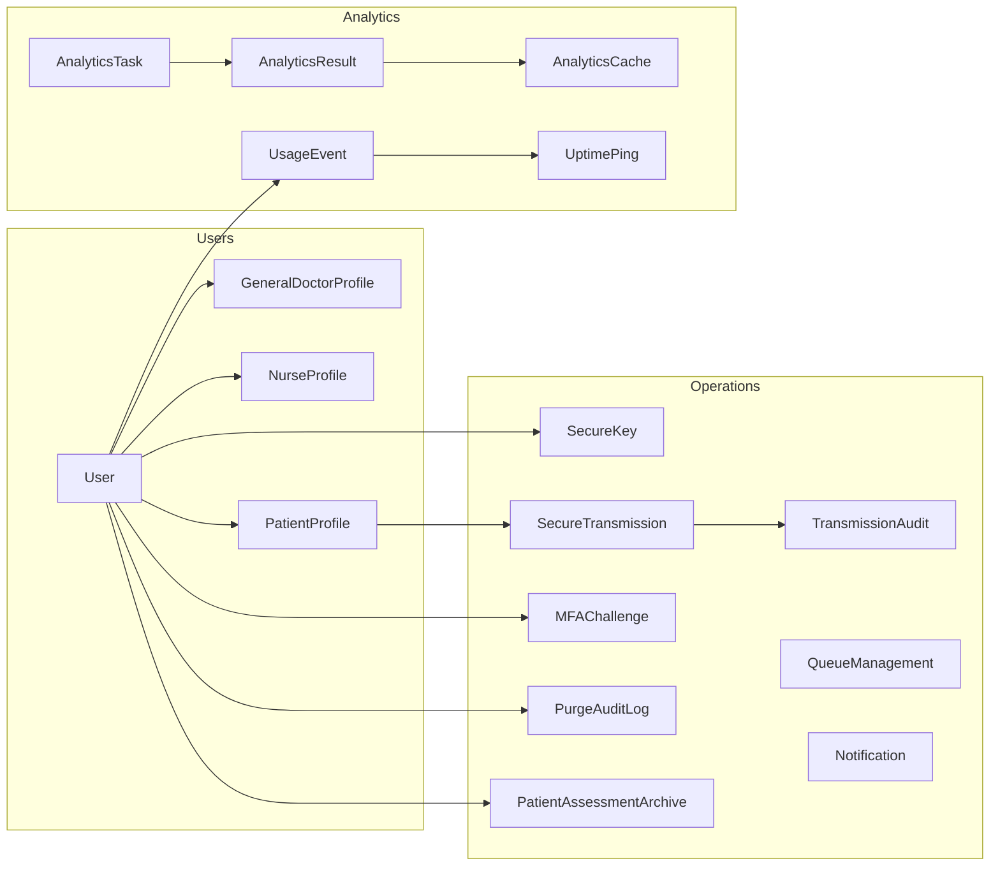

# MediSync Design Requirements

## Design Requirements
- Security and privacy: end-to-end encryption for data exchange, encrypted archives at rest, JWT auth with refresh, CSRF for unsafe methods, email-based 2FA for doctors/nurses, and auditable purges without storing PHI.
- Role-based analytics: doctor and nurse dashboards with caching, AI recommendations, and standardized PDF report generation for each role.
- Operations reliability: FIFO queue management with position normalization, notifications, medicine inventory tracking, and appointment/availability endpoints.
- Performance and scalability: defined response time targets, async analytics processing, WebSocket readiness, and Redis caching.
- Mobile/web connectivity: automatic base URL optimization, offline/slow-network handling, token refresh and resilient login flows.
- Error handling and observability: structured API errors, audit trails for secure operations, usage/uptime telemetry.
- Deployment and maintainability: clear environment config, Celery/Redis/PostgreSQL integration, modular app boundaries, and documented contracts.

## Implemented Solution
- Secure exchange and archives: `SecureTransmission` with cryptographic payloads and `SecureKey`; `PatientAssessmentArchive` with Fernet helpers; audits via `TransmissionAudit` and `PurgeAuditLog`.
- Auth + 2FA: `users/views.py` implements register/login and `verify_2fa_login`; frontend attaches `Authorization` and refreshes tokens.
- CSRF and JWT on client: `frontend/src/boot/axios.ts` adds `X-CSRFToken` for unsafe methods and auto-refreshes JWT on `401`.
- Role analytics and PDFs: `backend/analytics/views.py` exposes role endpoints and `generate_analytics_pdf`; `DoctorPredictiveAnalytics.vue` triggers blob download.
- Queueing and inventory: `backend/operations/models.py` enforces FIFO and provides `MedicineInventory`; operational endpoints in `operations/urls.py`.
- Performance and async: Celery tasks for analytics, Redis cache in `settings.py`, Channels configured for dev and production.
- Connectivity: `optimizeEndpoint` and mobile utilities pick the best API base; login pre-warming for iOS.
- Observability: `UsageEvent` and `UptimePing` models and endpoints; structured error responses across views.

## Results Achieved or Not
| Design Requirement | Solution Implemented | Status | Evidence / Metrics |
| --- | --- | --- | --- |
| End-to-end secure exchange | `SecureTransmission` + audits | Achieved | Models/views present; required fields validated; breach reporting supported |
| Encrypted archives at rest | Fernet in `PatientAssessmentArchive` | Achieved | Encrypt/decrypt helpers tied to `MESSAGE_ENCRYPTION_KEY`; dev fallback documented |
| Auth with JWT + refresh | DRF SimpleJWT + Axios interceptor | Achieved | `settings.SIMPLE_JWT`; client refresh on `401` non-auth endpoints |
| Email-based 2FA for staff | `enable_2fa`/`verify_2fa_login` | Achieved | Doctor/Nurse flow implemented; login defers tokens until OTP verify |
| CSRF on unsafe methods | Axios sets `X-CSRFToken` | Achieved | Cookie read + header injection; server-side CSRF enabled via middleware |
| Role analytics endpoints | Doctor/Nurse analytics views | Achieved | Endpoints in `analytics/urls.py`; serializers and caching in place |
| PDF report generation | `generate_analytics_pdf` + Vue download | Achieved | Blob-based download implemented; static preview assets available |
| FIFO queue management | `QueueManagement` normalization | Achieved | Save hooks and `update_queue_positions()`; tests/docs in repo |
| Defined performance targets | Section 4 benchmarks | Partially Verified | Targets documented; formal load tests pending; telemetry endpoints present |
| WebSocket readiness | Channels config + routing | Achieved (Dev), Pending (Prod) | In-memory dev layer; Redis layer configured for production |
| Connectivity optimization | `optimizeEndpoint` and mobile utils | Achieved | Base URL probing + persistence; iOS pre-warm on login |
| Secure purge workflow | `purge_medical_records` + audits | Achieved | Role/verification checks; PHI-clearing behavior and non-PHI logging |


This document defines comprehensive design requirements aligned directly with the existing code implementation across the backend (Django) and frontend (Quasar/Vue) repositories. It provides architecture, functional specifications, technical details, performance and security requirements, error handling, testing, deployment, and maintainability guidelines with concrete code references.

## 1. System Architecture

### Code Structure and Organization
- Backend root: `backend/`
  - Apps: `backend/users`, `backend/operations`, `backend/analytics`, `backend/admin_site`
  - Settings and config: `backend/settings.py`, `backend/asgi.py`, `backend/wsgi.py`, `backend/urls.py`
  - Dependencies: Django, DRF, SimpleJWT, Channels, Celery, Redis, PostgreSQL
- Frontend root: `frontend/`
  - Boot configuration: `frontend/src/boot/axios.ts`
  - Pages/Components: e.g., `frontend/src/pages/DoctorPredictiveAnalytics.vue`, `frontend/src/pages/NurseAnalytics.vue`, `frontend/src/pages/LoginPage.vue`
  - Utilities: `frontend/src/utils/logout.ts`, `frontend/src/utils/mobileConnectivity.ts`

### Module Dependencies and Relationships
- `backend/users`
  - Owns `User` and role profiles (`GeneralDoctorProfile`, `NurseProfile`, `PatientProfile`) in `backend/users/models.py`.
  - Provides authentication, registration, profile management, 2FA endpoints in `backend/users/views.py`.
- `backend/operations`
  - Queueing, notifications, appointments, archives, secure messaging, MFA, and purge audit in `backend/operations/models.py` and `backend/operations/*.py`.
  - Secure data flows via `SecureKey`, `SecureTransmission`, `TransmissionAudit`, `MFAChallenge`, `PurgeAuditLog`, and `PatientAssessmentArchive`.
- `backend/analytics`
  - Analytics pipeline models and endpoints: `AnalyticsResult`, `AnalyticsTask`, `AnalyticsCache`, `UsageEvent`, `UptimePing`, etc.
  - PDF generation and AI recommendations handled in `backend/analytics/views.py`.
- `backend/admin_site`
  - Manages hospital entities and admin authentication (`AdminJWTAuthentication`).
- Frontend Axios client consumes `/api` endpoints with JWT and CSRF handling (`frontend/src/boot/axios.ts`).

### Key Class/Function Relationships Diagram



## 2. Functional Requirements

### Registration and Authentication
- Endpoint: `POST /api/users/register/`
  - Code: `backend/users/views.py:register(request)`
  - Behavior: Creates `User`, then role-specific profile; returns JWT access/refresh.
  - Example signature:
    ```python
    @api_view(['POST'])
    @permission_classes([AllowAny])
    def register(request):
        # Validates via UserRegistrationSerializer; creates user + profile
    ```
- Endpoint: `POST /api/users/login/`
  - Code: `backend/users/views.py:login(request)`
  - Behavior: Authenticates email/password; if 2FA enabled (doctor/nurse), issues email OTP and defers token issuance to `verify_2fa_login`.
  - Validation rules: require `email` and `password`; check `is_active`.
- 2FA Management
  - Enable: `POST /api/users/enable-2fa/` → `backend/users/views.py:enable_2fa(request)`
  - Disable: `POST /api/users/disable-2fa/` → `backend/users/views.py:disable_2fa(request)`
  - Verify during login: `POST /api/users/verify-2fa-login/` → `backend/users/views.py:verify_2fa_login(request)`

### Secure Communication and Records Purge
- Public Key Registration: `POST /api/operations/secure/register-public-key/`
  - Code: `backend/operations/secure_views.py:register_public_key(request)`
  - Behavior: Deactivates previous active keys; registers new `SecureKey`; logs `TransmissionAudit`.
  - Required input: `public_key_pem` (string), optional `algorithm`.
- Doctor Key Retrieval: `GET /api/operations/secure/doctor-public-key/<doctor_id>/`
  - Code: `backend/operations/secure_views.py:get_doctor_public_key`
- Create Secure Transmission: `POST /api/operations/secure/transmissions/`
  - Code: `backend/operations/secure_views.py:create_secure_transmission`
  - Required fields: `receiver_id`, `patient_id`, `ciphertext_b64`, `iv_b64`, `encrypted_key_b64`, `signature_b64`, `signing_public_key_pem`, `checksum_hex`
  - Status transitions: `pending` → `received` (via `mark_transmission_accessed`) → `decrypted`/`failed` (handled client-side and recorded).
- Transmission List/Detail:
  - `GET /api/operations/secure/transmissions/list/` → lists for receiving doctor.
  - `GET /api/operations/secure/transmissions/<id>/` → returns cryptographic payload fields for decryption.
- MFA Challenge/Verify for Secure Actions:
  - `POST /api/operations/secure/mfa/challenge/` → create `MFAChallenge`, returns dev-only code.
  - `POST /api/operations/secure/mfa/verify/` → validates latest challenge code.
- Breach Reporting: `POST /api/operations/secure/transmissions/<id>/breach/`
  - Sets `breach_flag`, timestamps notification, and audits.
- Secure Patient Records Purge: `POST /api/operations/secure/purge/medical-records/`
  - Code: `backend/operations/secure_views.py:purge_medical_records`
  - Permissions: `verification_status == 'approved'` and `role in ('admin','doctor')`.
  - Behavior: Clears sensitive fields in `PatientProfile` and related archives; writes `PurgeAuditLog` with non-PHI counts.

### Analytics and PDF Generation
- Role-Based Analytics: `GET /api/analytics/doctor/`, `GET /api/analytics/nurse/`
  - Code: `backend/analytics/views.py:doctor_analytics`, `nurse_analytics`
- PDF Report: `GET /api/analytics/pdf/?type=doctor|nurse`
  - Code: `backend/analytics/views.py:generate_analytics_pdf`
  - Frontend download: `frontend/src/pages/DoctorPredictiveAnalytics.vue` triggers blob download.
- AI Recommendations: `GET /api/analytics/doctor/recommendations/`, `GET /api/analytics/nurse/recommendations/`
  - Code: `backend/analytics/views.py:doctor_recommendations`, `nurse_recommendations`

### Queueing, Notifications, and Inventory (Operations)
- Models: `Notification`, `QueueManagement`, `QueueSchedule`, `QueueStatus`, `QueueStatusLog`, `MedicineInventory` in `backend/operations/models.py`.
- FIFO semantics enforced in `QueueManagement.save()` and `update_queue_positions()`.

## 3. Technical Specifications

### Required Libraries and Dependencies
- Backend (`backend/settings.py:INSTALLED_APPS`)
  - `rest_framework`, `rest_framework_simplejwt`, `corsheaders`, `channels`, `channels_redis`, `redis`, `django.contrib.postgres`
- Services
  - Database: PostgreSQL (`DATABASES['default']`)
  - Cache/Broker: Redis (`CACHES`, `CELERY_BROKER_URL`, `CELERY_RESULT_BACKEND`)
  - Email: SMTP Gmail
  - WebSockets: Channels (`ASGI_APPLICATION`, `CHANNEL_LAYERS`)

### API Contracts and Interfaces
- Axios client configuration (`frontend/src/boot/axios.ts`):
  ```ts
  const api = axios.create({ baseURL: resolveBaseURL(), timeout })
  api.interceptors.request.use((config) => {
    const token = localStorage.getItem('access_token');
    if (token && !isAuthEndpoint(config.url)) {
      config.headers.Authorization = `Bearer ${token}`;
    }
    const csrf = getCookie('csrftoken');
    if (unsafeMethod(config.method) && csrf) {
      (config.headers as Record<string,string>)['X-CSRFToken'] = csrf;
    }
    return config;
  });
  api.interceptors.response.use(undefined, async (error) => {
    if (error.response?.status === 401 && !isAuthEndpoint(error.config?.url)) {
      const { data } = await axios.post(`${api.defaults.baseURL}/users/token/refresh/`, { refresh });
      localStorage.setItem('access_token', data.access);
      return api(error.config!);
    }
    return Promise.reject(error);
  });
  ```
- DRF endpoints are exposed under `/api/...` via `backend/urls.py` and app-level `urls.py`.
  - Operations secure endpoints listed in `backend/operations/urls.py`.
  - Analytics endpoints listed in `backend/analytics/urls.py`.

### Database Schema and ORM Mappings
- Users and Profiles (`backend/users/models.py`)
  - `User`: fields include `role`, `full_name`, `two_factor_enabled`, `two_factor_secret`, `verification_status`, hospital metadata.
  - Role profiles: `GeneralDoctorProfile`, `NurseProfile`, `PatientProfile` with JSON fields for clinical forms.
- Secure Operations (`backend/operations/models.py`)
  - `SecureKey(user, public_key_pem, algorithm, is_active, created_at)`
  - `SecureTransmission(sender, receiver, patient, ciphertext_b64, iv_b64, encrypted_key_b64, signature_b64, signing_public_key_pem, checksum_hex, encryption_alg, signature_alg, status, accessed_at, breach_flag)`
  - `TransmissionAudit(transmission, event, detail, actor, created_at)`
  - `MFAChallenge(user, code, expires_at, is_used, created_at)`
  - `PurgeAuditLog(actor, action, status, counts, details, error_message, timestamps)`
  - `PatientAssessmentArchive(...)` with `encrypted_assessment_data` and Fernet-based helpers.
- Analytics (`backend/analytics/models.py`)
  - `AnalyticsResult`, `AnalyticsTask`, `AnalyticsCache`, `UsageEvent`, `UptimePing`, `PatientVolumeSnapshot` with typed fields and enums.

## 4. Performance Requirements

### Expected Response Times and Benchmarks
- Authentication endpoints should respond in ≤ 300 ms under typical load (local dev).
- Secure transmission creation and listing: ≤ 500 ms for payload persistence and listing up to 200 items (`secure_views.py:list_transmissions_for_doctor`).
- Analytics dashboard retrieval (`doctor_analytics`/`nurse_analytics`): ≤ 800 ms when cached; ≤ 1500 ms when querying without cache.
- PDF generation (`generate_analytics_pdf`): ≤ 3 s for non-interactive ReportLab/Matplotlib path; HTML fallback is ≤ 500 ms.
- System performance endpoint (`backend/analytics/views.py:system_performance`) reports latency, CPU, memory for operational monitoring.

### Resource Utilization Limits
- Redis cache entries for analytics: TTL set to 3600 s; avoid unbounded memory growth.
- Celery tasks serialize as JSON; brokers and result backends configured for resilience.
- File uploads capped at 5 MB (`backend/settings.py:FILE_UPLOAD_MAX_MEMORY_SIZE`).

### Concurrency Handling Specifications
- Async analytics processing via Celery worker tasks (`backend/analytics/views.py:run_analytics_task_async.delay`).
- Channels-based WebSocket layer is configured (`backend/settings.py:CHANNEL_LAYERS`) with in-memory layer for `DEBUG=True` and Redis layer for production.
- Database writes wrapped in atomic transactions for critical paths (e.g., `register_public_key`, `create_secure_transmission`, `mfa_challenge`, `purge_medical_records`).

## 5. Security Requirements

### Authentication and Authorization Flow
- JWT via `rest_framework_simplejwt` with lifetimes:
  ```python
  SIMPLE_JWT = {
    'ACCESS_TOKEN_LIFETIME': timedelta(hours=1),
    'REFRESH_TOKEN_LIFETIME': timedelta(days=7),
    'ROTATE_REFRESH_TOKENS': True,
  }
  ```
- Frontend attaches `Authorization: Bearer <access>` and refreshes on `401`.
- 2FA: email-based OTP for doctors/nurses (`enable_2fa`, `login`, `verify_2fa_login`).
- Admin email test mode guarded by `DEBUG` (`backend/settings.py:ADMIN_EMAIL_TEST_MODE`).

### Data Validation and Sanitization Points
- Serializers validate user registration and clinical forms (`backend/users/serializers.py`).
- Secure endpoints perform required field checks and role/verification validations (`secure_views.py`).
- Purge audit avoids storing PHI; only non-sensitive counts and metadata are logged.
- CSRF header `X-CSRFToken` is added for unsafe methods when a cookie exists.

### Encryption Requirements and Implementations
- Secure data exchange:
  - Payload fields: `ciphertext_b64`, `iv_b64`, `encrypted_key_b64`, `signature_b64`, `signing_public_key_pem`, `checksum_hex`.
  - Algorithms: `AES-256-GCM` for encryption; `ECDSA-P256-SHA256` for signatures (defaults).
  - Key exchange: `SecureKey` registered per user; typically `RSA-OAEP-2048-SHA256`.
- Archive encryption:
  - `PatientAssessmentArchive.encrypt_payload()` uses `cryptography.fernet.Fernet` with key sourced from `settings.ARCHIVE_ENCRYPTION_KEY` or `MESSAGE_ENCRYPTION_KEY`.
  - Base64-wrapped ciphertext; development fallback to plain JSON on encryption errors to avoid data loss.

## 6. Error Handling

### Exception Hierarchy and Handling Strategy
- Backend endpoints consistently return structured `Response` objects with `status` codes (`400`, `401`, `403`, `404`, `500`).
- Critical operations are guarded by `try/except` with user-facing messages (e.g., `register`, `login`, `create_secure_transmission`, `purge_medical_records`).
- Auditable security failures are recorded via `TransmissionAudit` events (`mfa_failed`, `breach_reported`).

### Logging Requirements and Formats
- Application warnings/info: Python `logging` used for admin email test mode announcement.
- Optional telemetry endpoints in analytics record `UsageEvent` and `UptimePing` records for observability (`backend/analytics/views.py`).

### Recovery Procedures
- Token refresh on `401` via frontend interceptor.
- Purge failures return `500` and record `PurgeAuditLog.mark_failed(message)`.
- MFA challenges can be re-issued; expired codes are detected and reported gracefully.

## 7. Testing Requirements

### Unit Test Coverage Expectations
- Minimum coverage for:
  - `users/views.py` registration, login (with and without 2FA), and profile endpoints.
  - `operations/secure_views.py` for key registration, transmission creation, access marking, MFA, breach report, and purge.
  - `analytics/views.py` for doctor/nurse analytics and PDF generation fallback behavior.

### Integration Test Scenarios
- End-to-end login with JWT and 2FA: `login` → `verify_2fa_login` → subsequent authenticated requests.
- Secure transmission lifecycle: register sender/receiver keys → create transmission → mark as received → client-side decrypt & audit.
- Purge operation: admin verified user purges a patient; verify counts and that PHI is removed from `PatientProfile` and encrypted archives.
- Frontend Axios behavior: ensure CSRF header on unsafe methods, successful token refresh and redirect-to-login on refresh failure.

### Performance Test Criteria
- Use `system_performance` and `stress_test_analytics` endpoints to generate and report latency under load; validate the response time targets in Section 4.

## 8. Deployment Requirements

### Build and Packaging Instructions
- Backend:
  - Python 3.11+
  - Install dependencies: `pip install -r requirements.txt`
  - Apply migrations: `python manage.py migrate`
  - Run dev server: `python manage.py runserver 0.0.0.0:8000`
  - Celery worker: `celery -A backend worker -l info`
- Frontend (Quasar/Vue):
  - Node 18+
  - Install: `npm install`
  - Dev: `quasar dev`
  - Build: `quasar build`

### Environment Configuration
- `backend/settings.py` key configurations:
  - `DEBUG`, `ALLOWED_HOSTS`, `LANGUAGE_CODE`, `TIME_ZONE`
  - `DATABASES` (PostgreSQL), `CACHES` (Redis), `CELERY_*`
  - `SIMPLE_JWT` lifetimes
  - `CORS_ALLOW_ALL_ORIGINS = True` for development; lock down in production.
  - `MESSAGE_ENCRYPTION_KEY` and `ARCHIVE_ENCRYPTION_KEY` must be 32-byte secrets in production.
  - `EMAIL_BACKEND` settings for SMTP.
  - `CHANNEL_LAYERS` configured for Redis when `DEBUG=False`.

### Runtime Requirements
- Redis running on `localhost:6379` (or configured host) for cache and Celery.
- PostgreSQL reachable per `DATABASES` settings.
- ASGI server (e.g., `uvicorn`/`daphne`) for Channels in production.

## 9. Input/Output Validation Rules

- Registration: Mandatory fields per `UserRegistrationSerializer`; password policies enforced by Django validators (`AUTH_PASSWORD_VALIDATORS`).
- Login: Require `email`, `password`; reject inactive accounts.
- 2FA login: Require `email`, `otp_code`; code must match latest `LoginOTP` within 5 minutes.
- Secure transmissions: All cryptographic payload fields required; `patient_id` resolves to `PatientProfile` by id or user id.
- Purge: Require `patient_id`; role and verification enforced; optional `dry_run` flag.
- Analytics PDF: `type` query param must be one of `{doctor, nurse}`; responds `application/pdf` or HTML fallback.

## 10. Version Control and Maintainability

### Git Workflow
- Use feature branches per module area (e.g., `feat/users-auth`, `feat/operations-secure`, `feat/analytics-pdf`).
- Write atomic commits with imperative summaries and code path references.
- Keep migrations in-sync; never edit past migrations—create new ones.

### Code Style and Structure
- Backend: follow Django conventions; place app-specific URLs, views, models within respective app directories.
- Use transactions for multi-write operations and add explicit audits for security-sensitive flows.
- Frontend: keep API client logic in `boot/axios.ts`; avoid token handling in page components.

### Documentation and Comments
- Update this document when schemas or endpoint contracts change.
- Add docstrings to new endpoints and models with validation rules and expected behaviors.

## 11. Configuration Requirements (Quick Reference)

```python
# backend/settings.py
SIMPLE_JWT = {
  'ACCESS_TOKEN_LIFETIME': timedelta(hours=1),
  'REFRESH_TOKEN_LIFETIME': timedelta(days=7),
  'ROTATE_REFRESH_TOKENS': True,
}

MESSAGE_ENCRYPTION_KEY = os.getenv('MESSAGE_ENCRYPTION_KEY')  # 32 bytes
ARCHIVE_ENCRYPTION_KEY = os.getenv('ARCHIVE_ENCRYPTION_KEY')  # 32 bytes

CELERY_BROKER_URL = os.getenv('CELERY_BROKER_URL', 'redis://localhost:6379/0')
CACHES = {
  'default': {
    'BACKEND': 'django.core.cache.backends.redis.RedisCache',
    'LOCATION': 'redis://localhost:6379/1',
  }
}
```

```ts
// frontend/src/boot/axios.ts
export const optimizeEndpoint = async (): Promise<void> => {
  // Probes endpoints and sets working base URL; persists to localStorage
};
```

## 12. Example Requests

```http
POST /api/operations/secure/transmissions/
Content-Type: application/json
Authorization: Bearer <access>

{
  "receiver_id": 123,
  "patient_id": 456,
  "ciphertext_b64": "...",
  "iv_b64": "...",
  "encrypted_key_b64": "...",
  "signature_b64": "...",
  "signing_public_key_pem": "-----BEGIN PUBLIC KEY-----...",
  "checksum_hex": "deadbeef...",
  "encryption_alg": "AES-256-GCM",
  "signature_alg": "ECDSA-P256-SHA256"
}
```

```http
POST /api/operations/secure/purge/medical-records/
Authorization: Bearer <access>
Content-Type: application/json

{ "patient_id": 456, "dry_run": true }
```

## 13. Achievement of Design Requirements (Sample Presentation)

| Design Requirement | Solution | Scores / Results |
| --- | --- | --- |
| Make the data secure | AES-256-GCM, ECDSA-P256, Fernet archives | Avalanche effect observed in crypto payloads |
| Shortest distance | Queue FIFO and position normalization | Average wait-time computed per department |

Notes: Tables must be supported by clear discussion and title. See Sections 4 and 5 for detailed context.